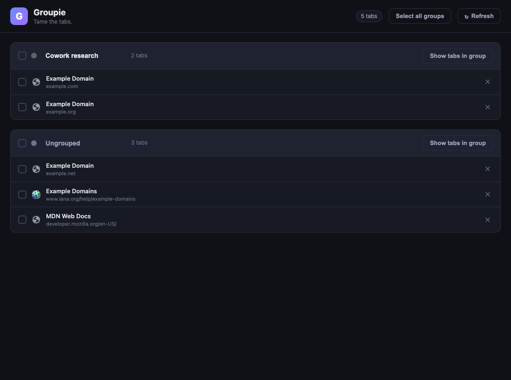
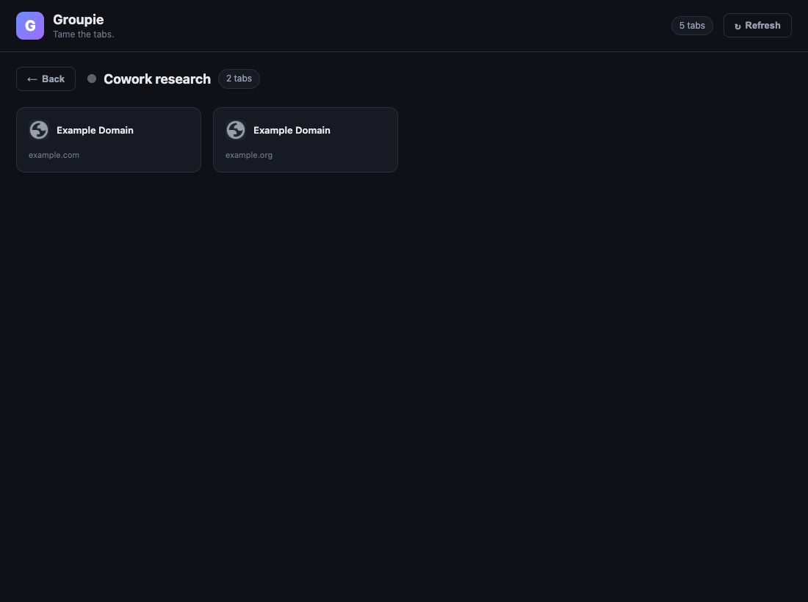

# Groupie

Groupie is a Chrome tab group manager. Claude Cowork opens way too many tabs
and never cleans up after itself, so Groupie gives you one screen to see every
open tab, close the ones you don't need, bundle the rest into named groups,
and jump into a grid view of any group.



## Features (V1)

- **See everything.** One page lists all open tabs across every window,
  organized by their Chrome tab group (plus an _Ungrouped_ section).
- **Select one or many.** Per-tab checkboxes, plus a _select all_ toggle.
- **Delete.** Close the selected tabs in a single click (or the `✕` on any row).
- **Group and rename.** Drop the selected tabs into a new named group, and
  rename any existing group inline (click its name, type, press Enter).
- **Show tabs in group.** Open any group in a grid view; click a tile to jump
  straight to that tab, or `✕` to close it.
- **Live.** The manager refreshes as tabs open, close, and move.



## Install (load unpacked)

Groupie is a plain Manifest V3 extension with no build step.

1. Open `chrome://extensions` in Chrome (or any Chromium browser).
2. Turn on **Developer mode** (top-right).
3. Click **Load unpacked** and select this repository's folder.
4. Pin the Groupie icon, then click it to open the tab manager.

## Usage

- Click the toolbar icon to open (or re-focus) the **Groupie** manager tab.
- Tick tabs to select them. A toolbar appears with:
  - a **New group name** field + **Group selected** button, and
  - a **Delete** button.
- To rename a group, click its title in the list, edit, and press **Enter**
  (**Esc** cancels).
- Click **Show tabs in group** on any group to open its grid; **Back** returns
  to the list.

> Note: Chrome only groups tabs within a single window. If your selection spans
> multiple windows, Groupie creates one group per window and gives them all the
> same name.

## Project layout

| File                                          | Purpose                                                      |
| --------------------------------------------- | ------------------------------------------------------------ |
| `manifest.json`                               | MV3 manifest (permissions: `tabs`, `tabGroups`).             |
| `background.js`                               | Service worker; opens/focuses the manager tab on icon click. |
| `manager.html` / `manager.css` / `manager.js` | The full-page manager UI.                                    |
| `icons/`                                      | Toolbar/store icons (generated).                             |
| `scripts/`                                    | Dev helpers (icon generation, tests).                        |

## Development

Regenerate the icons:

```bash
python3 scripts/make_icons.py
```

Run the end-to-end smoke test (loads the extension in Chromium and drives the
core flows). Requires Playwright's Chromium:

```bash
node scripts/verify_extension.mjs
```

Regenerate the README screenshots:

```bash
node scripts/screenshot.mjs
```
